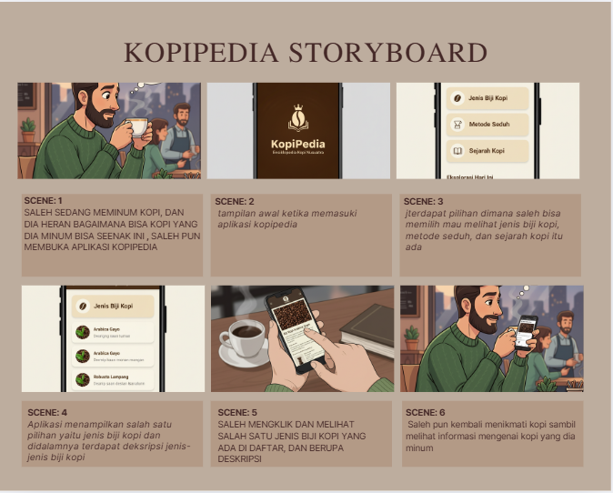
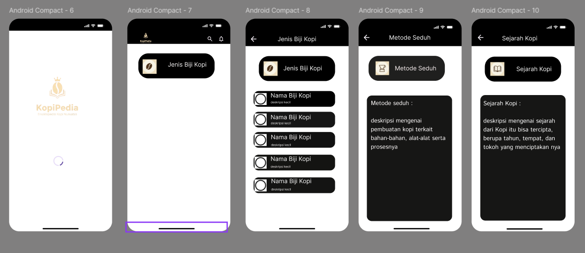
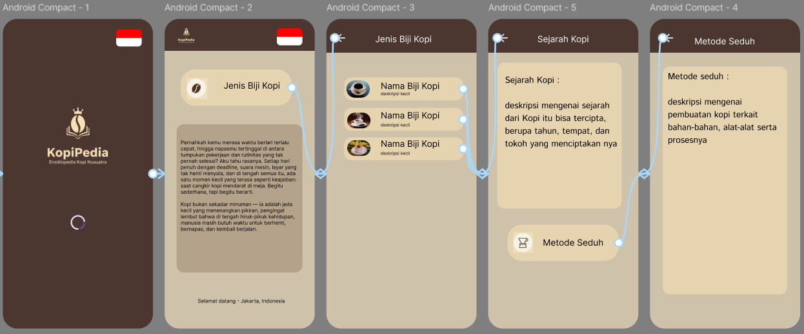
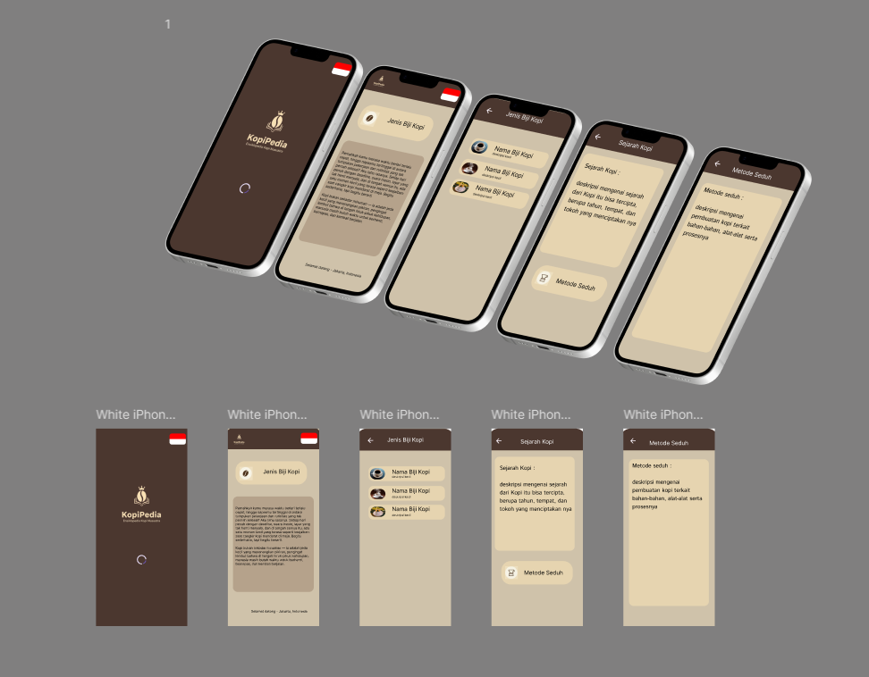
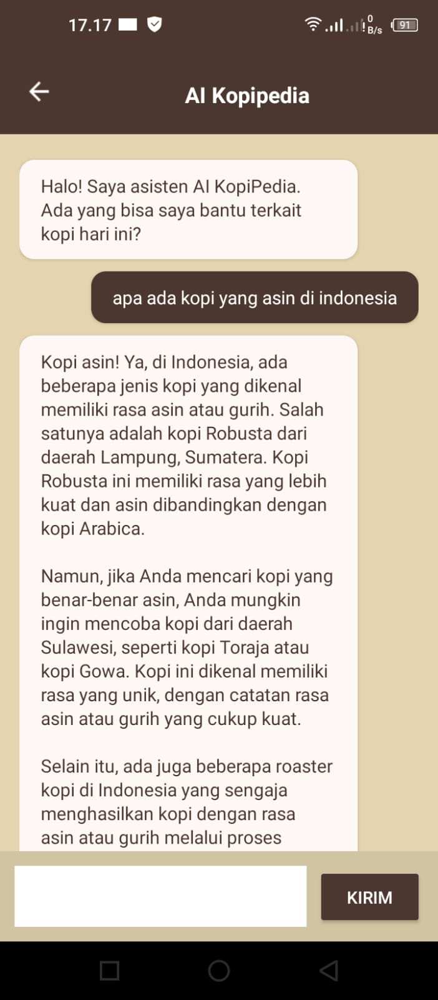

# KopiPedia_Android_Mobile
Nama: Den Fahmi Satria 

Nim: 312410523 

Kelas: TI.24.A5 

# KopiPedia ☕
Aplikasi Android berbasis edukasi untuk mengenal jenis-jenis biji kopi dan metode penyeduhannya secara presisi. 

Proyek ini dikelola menggunakan metodologi SCRUM. Progres pengerjaan dapat dilihat di: [https://sharing.clickup.com/90181231080/b/h/4-90187464600-2/c083bdd1631d20e] 

---

## 📌 Deskripsi Proyek
**KopiPedia** adalah aplikasi mobile yang dirancang untuk membantu pecinta kopi pemula maupun ahli dalam memahami perbedaan karakteristik biji kopi (Arabika, Robusta, dll) serta memberikan panduan langkah demi langkah metode penyeduhan yang paling sesuai.

### Fitur Utama:
- **Deteksi Lokasi Otomatis**: Menyesuaikan bahasa dan konten berdasarkan lokasi pengguna (Indonesia/Global).
- **Notifikasi Cerdas**: Menggunakan Firebase Cloud Messaging untuk tips kopi harian.
- **Katalog Biji Kopi**: Detail mendalam mengenai karakteristik rasa dan aroma.
- **Panduan Menyeduh**: Instruksi teknis penyeduhan yang disesuaikan dengan jenis biji kopi.
- **Fitur AI: Rekomendasi Kopi**: fitur ini menyediakan ruang kepada user untuk bertanya tentang apapun yang berkaitan dengan kopi.

---

## 🎨 Design Process

### 1. Storyboard
Alur cerita bagaimana pengguna berinteraksi dengan aplikasi, mulai dari Splash Screen hingga menemukan metode seduh yang tepat.

 

---

### 2. Wireframe (Low-Fidelity)
Kerangka dasar aplikasi yang dibuat di Figma untuk menentukan tata letak elemen tanpa gangguan visual warna.

 

---

### 3. UI Design (High-Fidelity)
Desain antarmuka pengguna akhir dengan tema warna Earthy (Cokelat & Cream) untuk memberikan kesan hangat dan organik seperti kopi.

 

---

### 4. Mockup
Representasi visual bagaimana aplikasi terlihat di perangkat Android nyata.

 

---

### 5. Fitur AI: rekomendasi Kopi

 

---

### 6. TimeLine: Clickup
 

 

---

## 🛠️ Tech Stack
- **Language**: Java
- **UI Framework**: Android XML (Material Design, CardView)
- **Backend/Service**: Firebase Cloud Messaging (FCM)
- **API/Library**: Google Play Services Location, Google Maps API
- **Design Tool**: Figma

---
